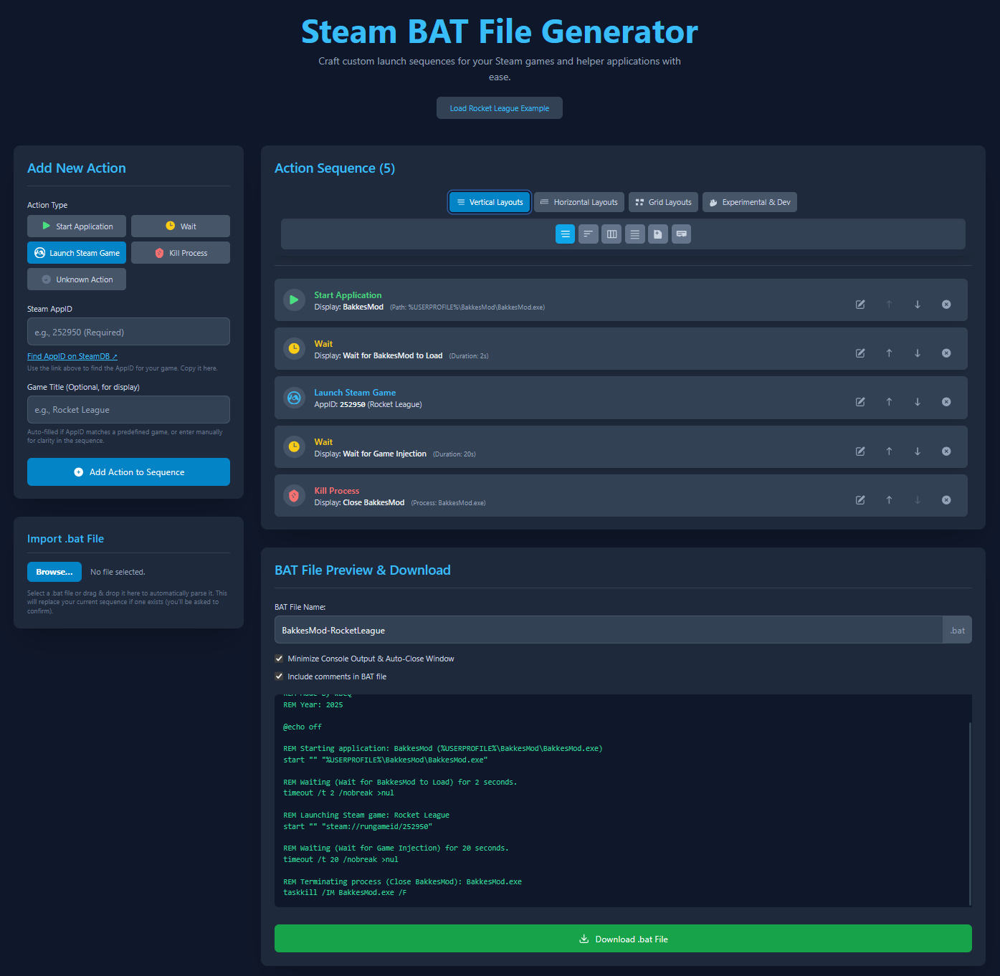

# Steam BAT File Generator

[](https://reactjs.org/)
[](https://vitejs.dev/)
[](https://www.typescriptlang.org/)
[](https://tailwindcss.com/)

A user-friendly, web-based tool to create custom `.bat` files for launching Steam games with a sequence of actions. Easily start helper applications, add delays, and kill processes to create the perfect automated launch script for your gaming sessions.



## ✨ Key Features

-   **Intuitive Interface:** Build your launch sequence with a simple, modern, and clean UI.
-   **Drag & Drop:** Easily reorder actions by dragging and dropping them into place.
-   **Multiple Action Types:**
    -   **Start Application:** Launch any helper application (`.exe`, etc.).
    -   **Launch Steam Game:** Start your game directly using its Steam AppID.
    -   **Wait:** Add a timed delay between actions to ensure processes have time to start.
    -   **Kill Process:** Terminate a running process by its name (e.g., to close a helper app).
-   **BAT File Importing:** Drag and drop an existing `.bat` file to automatically parse it into an editable action sequence.
-   **Live Preview:** Instantly see the generated script as you add and modify actions.
-   **Customization:** Choose to include comments in your script or minimize console output for a silent, auto-closing window.
-   **Helpful Tips:** An in-app guide shows you how to create a desktop shortcut for your script and change its icon for a professional look.
-   **Multiple View Modes:** Change how your action sequence is displayed, from a detailed list to icon-based grids, to suit your preference.

## 🛠️ Tech Stack

-   **Frontend:** React & TypeScript
-   **Build Tool:** Vite
-   **Styling:** Tailwind CSS

## 🚀 Run Locally

**Prerequisites:** You need to have [Node.js](https://nodejs.org/) (v18 or newer) installed on your system.

1.  **Clone the repository:**
    ```bash
    git clone https://github.com/your-username/steam-bat-file-generator.git
    cd steam-bat-file-generator
    ```

2.  **Install dependencies:**
    ```bash
    npm install
    ```

3.  **Run the development server:**
    ```bash
    npm run dev
    ```

    The application should now be running on `http://localhost:5173`.

## 📄 How to Use

1.  **Add Actions:** Use the **"Add New Action"** panel on the left to add steps to your script.
2.  **Configure Actions:** Fill in the necessary details for each action, such as the application path, Steam AppID, or wait duration.
3.  **Arrange the Sequence:** Drag and drop the actions in the main panel to set the correct execution order.
4.  **Customize & Download:**
    -   Give your script a custom file name.
    -   Choose your preferred script options (e.g., minimize output, include comments).
    -   Review the live preview to see the final script.
    -   Click the **"Download .bat File"** button.
5.  **Create a Shortcut (Recommended):**
    -   Find the downloaded `.bat` file on your computer.
    -   Right-click it and select "Send to" > "Desktop (create shortcut)".
    -   You can now rename the shortcut and change its icon by following the in-app **"Tips & Tricks"** section.

## 🌐 Online Version

[](https://kbeq.itch.io/steam-bat-file-generator)

## 🤝 Contributing

Contributions are always welcome! Feel free to open an issue to report bugs or suggest features, or submit a pull request with your improvements.

## ✍️ Author

Created by **kBeQ**.

If you find this tool useful, consider supporting the developer!
<br>
<a href="https://ko-fi.com/kbeq_" target="_blank" rel="noopener noreferrer">
  
</a>

## 📄 License

This project is licensed under the MIT License. See the `LICENSE` file for details.